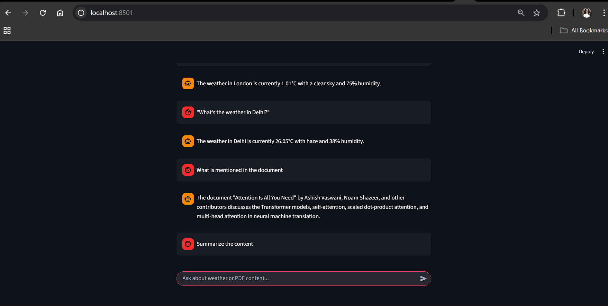

# 🌦️📄 LangGraph Agentic Pipeline — Weather & PDF RAG

A simple yet powerful agentic system that intelligently routes user queries to either fetch **real-time weather data** or answer questions from a **PDF using RAG**.

---

## 🎯 Objective

Build a clean, modular AI pipeline using **LangChain**, **LangGraph**, and **LangSmith** to demonstrate:

- Embeddings  
- Vector databases  
- Retrieval-Augmented Generation (RAG)  
- Agentic decision-making  
- Good coding & architectural practices  

---

## 📘 Project Overview

This project implements a **decision-driven agentic pipeline** that evaluates each user query and determines the optimal processing route.

Using **LangGraph** for workflow orchestration and node-based decision logic, the system intelligently chooses between two paths:

### 🔹 1. Weather API  
If the query relates to weather, the system:
- Detects intent  
- Calls the weather API  
- Returns real-time meteorological data  

### 🔹 2. PDF RAG (Retrieval-Augmented Generation)  
If the query seeks information from the document:
- The system retrieves relevant context from **Qdrant** vector DB  
- Embeddings are generated from the provided PDF  
- A language model synthesizes an answer  

This hybrid approach ensures:
- Accurate and context-aware responses  
- Efficient routing and lower latency  
- Scalable architecture suitable for larger multi-agent systems  

---

## 🌐 Chatbot in Action - Live  
**Hosted App:**  
https://langchain-agent-7c6j.onrender.com/

---

## 📊 Chatbot 



## Setup

### 1. Clone repo
```bash 
git clone https://github.com/snepraj2709/langchain_agent.git
cd langchain_agent
```

### 2. Install Dependencies

```bash
pip install -r requirements.txt
.venv/Scripts/activate
```

### 3. Environment Variables

Create a `.env` file:

```
OPENAI_API_KEY=your_openai_api_key
OPENWEATHER_API_KEY=your_openweather_api_key
LANGSMITH_API_KEY=your_langsmith_api_key
LANGCHAIN_TRACING_V2=true
LANGCHAIN_PROJECT=weather-rag-agent
```


### 4. Create Sample PDF

Add your own `sample.pdf` file else by default it will be [Attention Is All You Need](https://proceedings.neurips.cc/paper_files/paper/2017/file/3f5ee243547dee91fbd053c1c4a845aa-Paper.pdf)

### 5. Run Tests

```bash
pytest test_agent.py -v
```

### 6. Start Streamlit App

```bash
streamlit run app.py
```

### 4. Test Queries

**Weather queries:**
- "What's the weather in London?"
- "Tell me the temperature in Paris"

**PDF queries:**
- "What is mentioned in the document?"
- "Summarize the content"

## How It Works

1. **Router Node**: LLM determines if query is about weather or PDF content
2. **Weather Node**: Extracts city name and calls OpenWeatherMap API
3. **PDF Node**: Retrieves relevant chunks from vector database using RAG
4. **Response Node**: LLM generates final answer based on context
5. **LangSmith**: Automatically traces all LLM calls for evaluation

## Architecture Flow

```
User Query → Router → [Weather API | PDF RAG] → Response Generator → User
```

## Key Components

- **LangGraph**: Orchestrates the agentic workflow
- **OpenWeatherMap**: Provides real-time weather data
- **Qdrant**: Vector database for embeddings (in-memory)
- **LangChain**: LLM integration and document processing
- **LangSmith**: Automatic tracing and evaluation
- **Streamlit**: Simple chat interface

## Notes

- All LLM calls are traced in LangSmith automatically via environment variables
- Vector database runs in-memory (no external setup needed)
- Code is minimal and modular
- Each component is independently testable